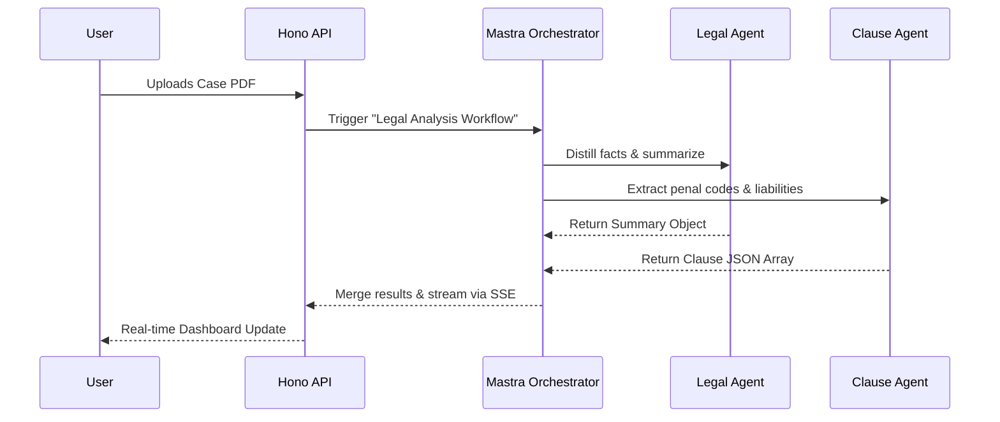
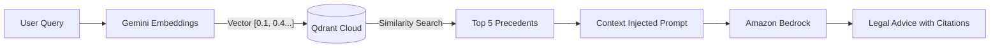
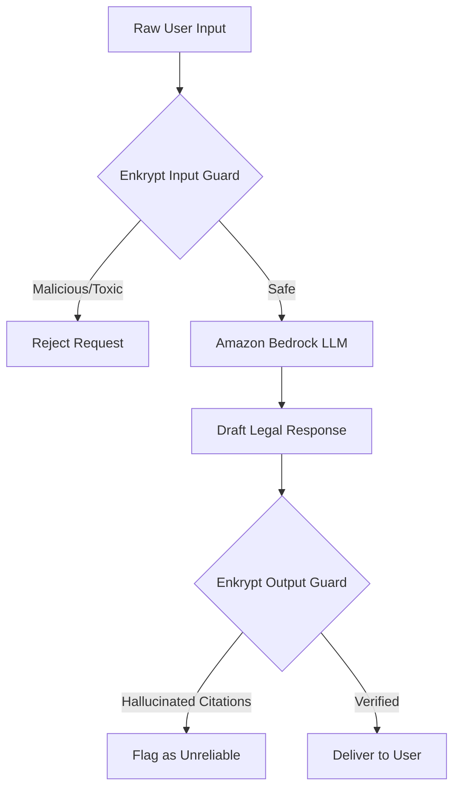
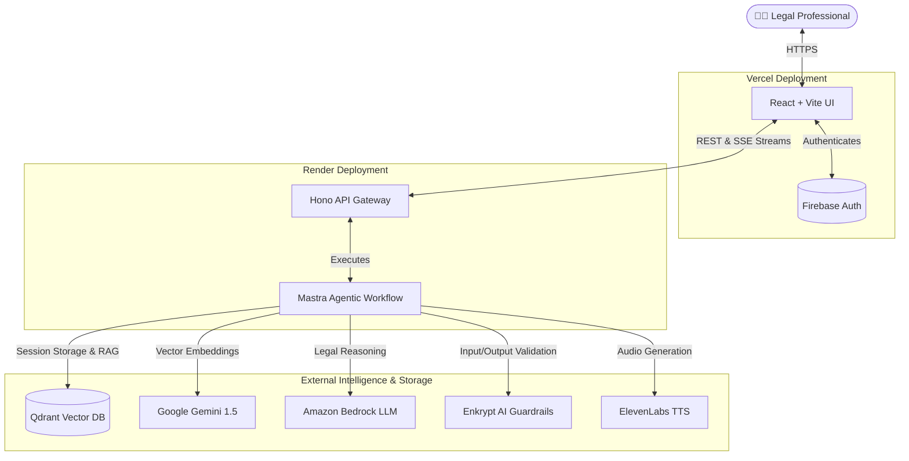

<div align="center">
  
  <h1>LexAgent (Mandamus Judicial Platform)</h1>
  <p><strong>An Enterprise-Grade, Agentic Legal Co-Pilot tackling the Global Case Pendency Crisis.</strong></p>

  [](https://reactjs.org/)
  [](https://mastra.ai/)
  [](https://hono.dev/)
  [](https://qdrant.tech/)
  [](https://enkryptai.com/)
  [](https://aws.amazon.com/bedrock/)
</div>

<br/>

## 📖 Table of Contents

| Section | Description |
| :--- | :--- |
| **[1. The Problem & Our Solution](#-the-problem--our-solution)** | Overview of the pendency crisis and Judge-in-the-Loop philosophy |
| **[2. Hackathon Core Technologies](#-hackathon-core-technologies)** | Deep dive into **Mastra**, **Qdrant**, and **Enkrypt AI** integrations |
| **[3. Project Highlights & Engineering Standards](#-project-highlights--engineering-standards)** | How LexAgent achieves enterprise-scale reliability |
| **[4. Master System Architecture](#-master-system-architecture)** | End-to-end system and deployment architecture diagram |
| **[5. Additional Capabilities](#-additional-capabilities)** | Features like ElevenLabs TTS and Firebase Auth |
| **[6. Local Setup & Installation](#-local-setup--installation)** | Step-by-step instructions to run LexAgent locally |
| **[7. Production Deployment](#-production-deployment)** | Instructions for Vercel (Frontend) and Render (Backend) |

---

## 🌍 The Problem & Our Solution

Courts worldwide are suffocating under a massive backlog of pending cases. Legal professionals spend hundreds of hours manually reading documents, analyzing clauses, and searching for relevant case law. 

**LexAgent** is our solution. Designed with a strict **"Judge-in-the-Loop"** philosophy, LexAgent does not attempt to replace human judgment. Instead, it acts as a hyper-intelligent, agentic co-pilot that ingests hundreds of pages of legal text, performs semantic precedent searches, analyzes clauses, and evaluates risks—all under 60 seconds.

---

## 🏆 Hackathon Core Technologies

To achieve enterprise-grade reliability, LexAgent leverages three critical pillars required for modern AI applications: Orchestration, Memory, and Security.

### 1. Mastra (Agent Orchestration Framework)
We utilized **Mastra** as the central nervous system of our backend. Instead of writing brittle, linear LLM chains, Mastra allows us to define highly specialized "Agents" that collaborate together. 

- **Legal QA Agent**: Handles general inquiries and interprets the user's intent.
- **Clause Analysis Agent**: Specifically extracts, parses, and identifies risks in contract clauses.
- **Jurisdiction Agent**: Determines the appropriate legal jurisdiction for uploaded documents to narrow down precedent searches.

**How Mastra fits in:**


### 2. Qdrant (Vector Database & Memory)
LexAgent requires both long-term memory for user sessions and semantic understanding of massive legal databases. **Qdrant** powers both of these requirements simultaneously.

- **Precedent RAG (Retrieval-Augmented Generation)**: When a lawyer asks a question, LexAgent converts it into embeddings using `Google Gemini (text-embedding-004)` and searches a Qdrant cluster to retrieve the top 5 most legally relevant historical cases.
- **Session Persistence**: We store entire conversational threads, metadata, and user project groupings directly in Qdrant, allowing users to seamlessly resume their research weeks later.

**The Qdrant RAG Pipeline:**


### 3. Enkrypt AI (Security & Guardrails)
An AI lawyer that hallucinates fake cases is worse than no AI at all. We integrated **Enkrypt AI** to provide an impenetrable defense mechanism around our LLMs, ensuring enterprise compliance.

- **Input Guard (Prompt Injection Defense)**: Before a user's prompt ever reaches Amazon Bedrock, Enkrypt AI scans it for malicious injections attempting to "jailbreak" the agent into bypassing legal confidentiality constraints.
- **Output Guard (Hallucination Prevention)**: After the LLM generates a legal draft, Enkrypt AI acts as an Output Guard. We cross-reference the generated citations against the facts retrieved from Qdrant. If the AI invents a penal code or case law that doesn't exist, the Output Guard flags it and blocks it from being presented to the user.

**The Enkrypt Security Funnel:**


---

## 🎯 Project Highlights & Engineering Standards

LexAgent is engineered to meet rigorous enterprise standards across system design, code quality, and user experience:

| Feature/Standard | How LexAgent Excels |
| :--- | :--- |
| **Engineering Quality** | Built with a robust, type-safe **TypeScript** stack (Node/Hono/React). We implemented proper environment isolation, clean service abstractions, and robust error handling for LLM timeouts. |
| **AI Agent Workflow** | We moved beyond simple single-prompt chatbots. By utilizing a multi-agent workflow, we route complex legal documents through specialized agents (Extraction, Reasoning, Drafting) in parallel and sequence. |
| **System Design** | We implemented a deliberate **Split Architecture**: Vercel handles the blazing-fast React CDN, while Render hosts the Hono API to completely bypass serverless timeout limits (10s) that would otherwise kill long-running PDF extractions. |
| **Mastra Integration** | Mastra is the backbone of our backend, orchestrating the state, memory, and tool-calling execution of our `LegalAgent` and `ClauseAgent` autonomously. |
| **Qdrant Usage** | We maximized Qdrant's utility by using it for two distinct purposes: **1)** High-dimensional semantic search for legal precedents (RAG), and **2)** Persistent, session-based conversational memory storage. |
| **Enkrypt AI Integration** | We implemented a dual-layered defense. **Input Guards** prevent malicious prompt injections from users, and **Output Guards** cross-check generated claims against Qdrant to prevent the AI from hallucinating fake laws. |
| **Innovation** | Instead of claiming to "replace lawyers," we built a realistic **"Judge-in-the-Loop"** platform. We focus on accelerating the boring parts (document parsing, precedent searching) while leaving the final judgment to humans, making this a highly realistic MVP for the current case pendency crisis. |
| **User Experience** | We built a ChatGPT-style conversational interface featuring real-time **SSE streaming** (so users don't stare at loading spinners), a premium dark-mode legal aesthetic, and integrated **ElevenLabs TTS** for audio accessibility. |
| **Code Quality** | The codebase is strictly organized into decoupled layers: UI components, State Contexts, API Routes, Agent Definitions, and Provider Libraries (Qdrant/Enkrypt). |

---

## 🧠 Master System Architecture

By combining these incredible technologies, we built a highly decoupled, scalable architecture. The frontend is hosted on a fast CDN, while the Hono server runs on a dedicated instance to manage long-running PDF extraction and RAG workflows.



---

## ⚡ Additional Capabilities

- **Real-Time Text-to-Speech**: Built-in integration with **ElevenLabs**, allowing visually impaired users or busy professionals to have generated legal briefs and insights read aloud instantly.
- **Persistent Conversational UI**: A ChatGPT-style interface with full chat history, pinned sessions, workspaces, and real-time Server-Sent Events (SSE) streaming.
- **Secure Enclave**: Powered by Firebase Authentication for enterprise-grade secure access, supporting both Google OAuth and traditional Email/Password strategies.

---

## 📂 Project Structure

```text
legal-agent-mvp/
├── frontend/                 # React UI Workspace
│   ├── src/
│   │   ├── components/       # UI Components (Dashboard, Chat, Cards)
│   │   ├── context/          # State Management (Auth, History)
│   │   └── lib/              # Firebase Initialization
│   ├── index.html            # Vite Entry
│   └── vercel.json           # Vercel Deployment Config
├── src/                      # Backend Node.js Workspace
│   ├── mastra/               # Mastra Agent Definitions
│   │   ├── agents/           # Legal, Drafting, & QA Agents
│   │   └── workflows/        # Orchestrated Analysis Workflows
│   ├── lib/
│   │   ├── enkrypt.ts        # Enkrypt AI Guardrail Integrations
│   │   └── qdrant.ts         # Vector DB & Chat History Logic
│   └── server.ts             # Hono API Gateway & Routing
├── package.json              # Monorepo Dependencies
└── render.yaml               # Render Deployment Config
```

---

## 🚀 Local Setup & Installation

### 1. Prerequisites
Ensure you have the following installed:
- **Node.js** (v20+)
- **npm** or **yarn**

### 2. Environment Setup
You will need two `.env` files to run the project.

**Root Directory (`/.env`)**:
```env
GOOGLE_GENERATIVE_AI_API_KEY=your_gemini_key
QDRANT_URL=your_qdrant_cluster_url
QDRANT_API_KEY=your_qdrant_key
ENKRYPTAI_API_KEY=your_enkrypt_key
AWS_ACCESS_KEY_ID=your_aws_key
AWS_SECRET_ACCESS_KEY=your_aws_secret
AWS_REGION=us-east-1
ELEVENLABS_API_KEY=your_elevenlabs_key
PORT=3001
```

**Frontend Directory (`/frontend/.env`)**:
```env
VITE_FIREBASE_API_KEY=your_firebase_key
VITE_FIREBASE_AUTH_DOMAIN=your_firebase_domain
VITE_FIREBASE_PROJECT_ID=your_firebase_project_id
VITE_API_URL=http://localhost:3001
```

### 3. Running Locally

Install all dependencies from the root:
```bash
npm install
cd frontend && npm install
cd ..
```

Start the Backend (runs on port 3001):
```bash
npm run dev
```

Start the Frontend (runs on port 5173):
```bash
cd frontend
npm run dev
```

---

## 🌐 Production Deployment

The repository is pre-configured for modern, serverless-friendly deployments.

- **Frontend**: Designed for 1-click deployment on **Vercel**. Select the `frontend` folder as your Root Directory.
- **Backend**: Designed for deployment on **Render.com** (to avoid Vercel's 10-second serverless timeout). A `render.yaml` blueprint is included in the root directory.

---

<div align="center">
  <i>Built with ❤️ for the HiDevs x Mastra Hackathon.</i>
</div>
